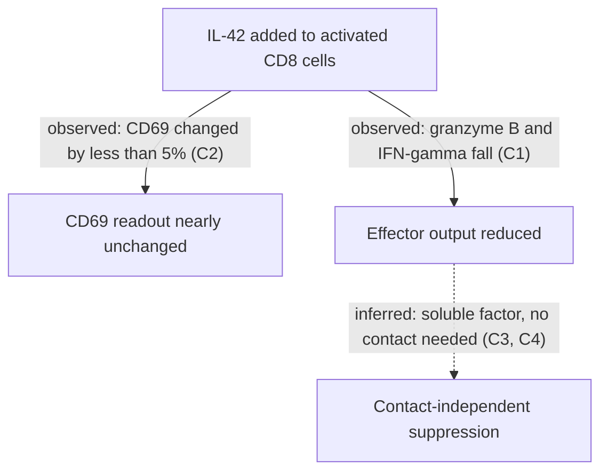
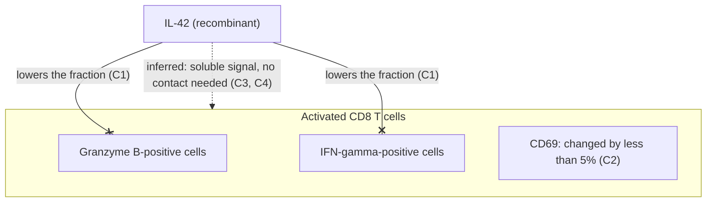

<!-- SYNTHETIC EXAMPLE: the paper, authors, journal, DOI and results below are invented to show the layout. Do not cite or reuse this content. -->

> [!abstract] TL;DR
> **Did:** The authors treated activated human CD8 T cells with recombinant IL-42 and measured CD69, IFN-gamma and granzyme B after 24 hours. They also ran a transwell test and an antibody rescue.
> **Found:** IL-42 lowered granzyme B and IFN-gamma but left CD69 almost unchanged. The effect did not need cell contact.
> **Trust:** Direct in vitro evidence at one time point. The paper has no in vivo test and does not identify the IL-42 receptor.
> **Why it matters here:** It supports granzyme B as the best readout for cytokine-mediated CD8 suppression.
> **Source:** paper.md

## Claims

- **C1** [measured] IL-42 at 20 ng/mL reduced granzyme B-positive primary human CD8 cells by 38% and IFN-gamma-positive cells by 24%. (§Results 1)
- **C2** [measured] CD69 changed by less than 5%. (§Results 2)
- **C3** [measured] Suppression also occurred when a transwell separated the secreting cells from the responder cells. (§Results 3)
- **C4** [inferred] The authors infer that IL-42 acts through a soluble, contact-independent mechanism that lowers effector output instead of blocking activation. (§Results 2, §Results 3, §Interpretation)
- **C5** [measured] Jurkat cells showed a weaker granzyme B reduction (about 15%) than primary cells. (§Results 4)
- **C6** [measured] Anti-IL-42 antibody restored granzyme B to near baseline. (§Results 5)

## Reasoning

The authors first separate early activation from later effector output. They then test whether contact is needed. In the first diagram, solid arrows were observed and dashed arrows were inferred.

The second diagram shows who acts on whom. A line ending in a cross means the paper observed a decrease in the named readout, and a dashed line is inferred. The CD69 box has no line. The paper saw no clear change, so the null result is written in the box and not drawn as a link.

1. **Early activation:** CD69 changed by less than 5% (C2). The authors read this as largely preserved activation (C4).
2. **Effector output:** Granzyme B-positive and IFN-gamma-positive cells dropped at 20 ng/mL (C1).
3. **Contact test:** Suppression persisted when a transwell separated the cells, which argues for a soluble mechanism (C3, C4).
4. **Specificity:** Anti-IL-42 antibody restored granzyme B to near baseline (C6).
5. **Cell model:** Jurkat cells responded less than primary cells (C5).

## Evidence

- The assay used 0, 5 and 20 ng/mL IL-42 with readouts after 24 hours. (§Experimental setup)
- 20 ng/mL IL-42 reduced granzyme B-positive primary CD8 cells by 38%. (§Results 1)
- IFN-gamma-positive cells dropped by 24% at the same dose. (§Results 1)
- CD69 changed by less than 5%. (§Results 2)
- The transwell condition showed similar suppression. (§Results 3)
- Jurkat cells showed about 15% granzyme B reduction. (§Results 4)
- Anti-IL-42 antibody restored granzyme B close to baseline. (§Results 5)

## Figure Map

<!-- No data figures found in compiled sources -->

## Assumptions

*Analyst layer: limits of the evidence as judged from the compiled sources.*

- The authors assume that the 24-hour assay captures the relevant suppression window. Only one time point was tested.
- Granzyme B serves as the main readout of suppression.
- The transwell result may reflect the assay setup and not a true contact-independent effect.
- The authors note that Jurkat cells may not reproduce the full effect size seen in primary cells.

## Takeaways

### Plain-language summary

IL-42 appears to weaken the killing machinery of activated CD8 T cells. It lowers granzyme B and IFN-gamma but does not stop the cells from switching on. The effect persisted when the cells were physically separated, so a soluble signal is likely.

### What the paper does not prove

The paper does not show the effect in vivo, over longer times, or through a known receptor.

### Related notes

The IL-42 entity note and a CD8 suppression concept note are the natural targets for KB mapping.

## Extensions

- Identify the receptor or downstream pathway responsible for the IL-42 effect.
- Test whether the contact-independent result reproduces across other cell systems.
- Check whether primary-cell suppression persists at longer time points or in vivo.
- Compare IL-42 against other suppressive cytokines using the same granzyme B-focused assay.
