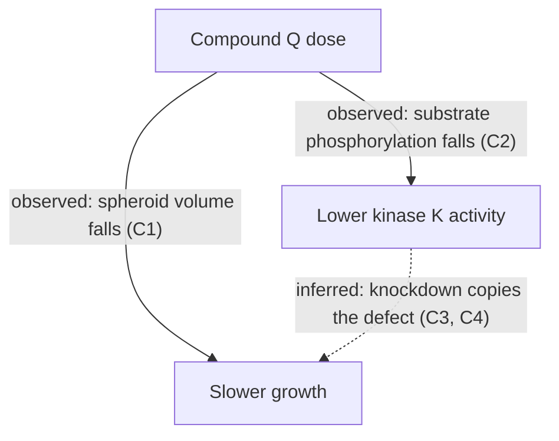

<!-- SYNTHETIC EXAMPLE: invented paper, authors, DOI and results used only as a lint fixture. -->

> [!abstract] TL;DR
> **Did:** The authors dosed 3D tumour spheroids with compound Q and measured growth, kinase K activity and cell death. They tested a kinase K knockdown as a control.
> **Found:** Compound Q slowed spheroid growth in a dose-dependent way, and kinase K activity fell. Knockdown of kinase K gave a similar growth defect.
> **Trust:** Direct evidence in two cell lines. Off-target effects were not ruled out, and no animal data are included.
> **Why it matters here:** It gives a dose range and a readout for testing kinase K in our own spheroid model.
> **Source:** paper.pdf

## Claims

- **C1** [measured] Compound Q reduced spheroid volume in a dose-dependent way in both cell lines. (Fig 1A–D)
- **C2** [measured] Compound Q lowered phosphorylation of the kinase K substrate in treated spheroids. (Fig 2B, E2)
- **C3** [measured] Knockdown of kinase K slowed spheroid growth to a similar degree. (Fig 3A–C, E3)
- **C4** [inferred] The authors infer that compound Q acts mainly through kinase K, because drug and knockdown gave similar defects. (Fig 2B, Fig 3A–C, E2, E3)
- **C5** [measured] Cell death rose only at the highest dose. (Fig 4A; supp1.pdf, Suppl. S3)

## Reasoning

The authors link drug exposure to growth, then compare the drug with a genetic control. Solid arrows were observed and dashed arrows were inferred.

1. **Dose response:** Spheroid volume fell as the dose rose (C1).
2. **Target engagement:** Substrate phosphorylation fell with the drug (C2).
3. **Genetic control:** Knockdown of kinase K gave a similar growth defect (C3).
4. **Toxicity:** Cell death rose only at the highest dose (C5).

## Evidence

- (Fig 1A–D) Volume at day 7 fell from 100% to 41% at the top dose in line A and to 48% in line B.
- **E2** (Fig 2B) Substrate phosphorylation fell by about 60% at 1 µM.
- **E3** (Fig 3A–C) Knockdown cells reached 52% of control volume at day 7.
- The apoptosis marker rose 3-fold at 10 µM and was flat below 3 µM. (Fig 4A, PDF p. 7)

## Figure Map

### Main figures

| Figure | What it shows | Significance |
|---|---|---|
| Fig 1A–D | Spheroid volume over 7 days at four doses in two cell lines. | Shows the dose response behind C1. |
| Fig 2B | Western blot of the substrate phosphorylation after drug exposure. | Shows target engagement behind C2. |
| Fig 3A–C | Growth curves of control and kinase K knockdown spheroids. | Supports the genetic-control argument behind C3. |
| Fig 4A | Apoptosis marker by dose. | Supports the toxicity statement behind C5. |

### Supplementary

| Figure | What it shows | Significance |
|---|---|---|
| Suppl. S3 | Cell viability at each dose. | Confirms low toxicity below the top dose. |

## Assumptions

*Analyst layer: limits of the evidence as judged from the attached sources.*

- Two cell lines may not represent other tumour types.
- Knockdown efficiency was reported once and may vary between batches.
- The authors note that off-target drug effects were not tested.

## Takeaways

### Plain-language summary

Compound Q makes tumour spheroids grow more slowly. The drug lowers kinase K activity, and removing kinase K gives a similar slowdown. These two results together suggest the drug works through kinase K.

### What the paper does not prove

The paper does not exclude other drug targets or show an effect in animals.

## Extensions

- Test compound Q in our spheroid model at 1 µM and 3 µM.
- Add a kinase-dead rescue to separate drug effects from knockdown effects.

## Appraisal: Selectivity of compound Q

*External comparison. Each item cites its source or says "not verified".*

- A kinase panel in a separate study reported weak activity of compound Q against kinase L (Smith 2024, Table 2).

> [!warning] Not verified
> A reviewer comment claimed that compound Q also inhibits kinase M. No primary study confirming this was found.
